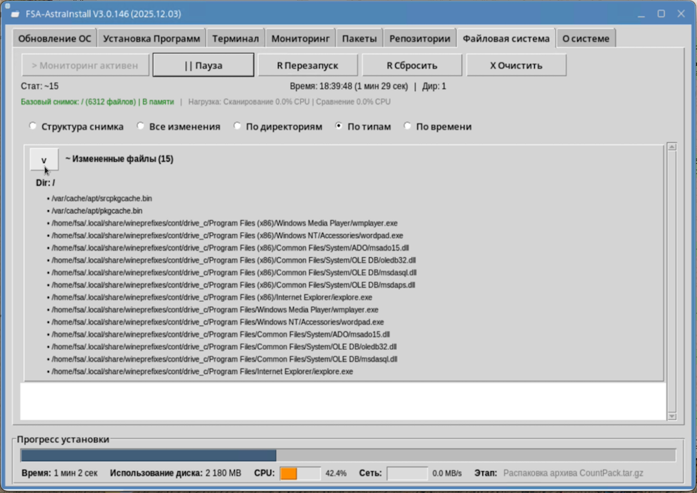
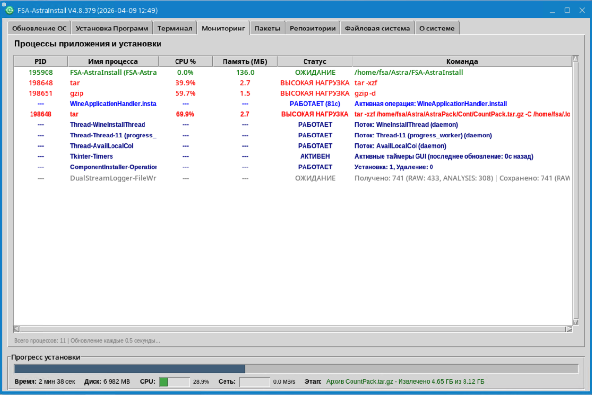
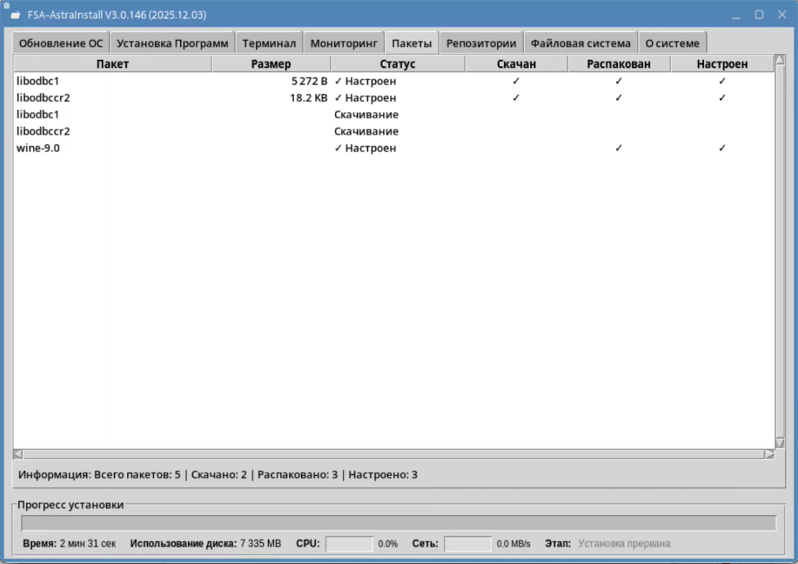
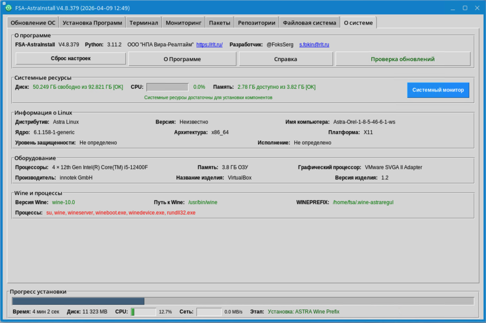

# FSA-AstraInstall

**Версия:** V4.1.308 (2026.01.21)  
**Компания:** ООО "НПА Вира-Реалтайм"  
**Разработчик:** @FoksSegr & AI Assistant  
**Сайт:** [https://rlt.ru/](https://rlt.ru/)

---

## 📖 О проекте

**FSA-AstraInstall** — профессиональная система автоматизации для управления Linux-системами с **графическим интерфейсом** и **консольным режимом**. Комплексное решение для автоматического обновления операционных систем, установки и управления компонентами Wine, настройки репозиториев и мониторинга процессов.

### 🎯 Ключевые возможности

- 🍷 **Управление Wine** — установка различных версий Wine, создание и управление WINEPREFIX, множественные экземпляры приложений
- ⚡ **Автоматизация системы** — полное обновление ОС с автоответами на интерактивные запросы
- 📦 **Менеджер компонентов** — установка/удаление Astra.IDE, Wine-приложений, winetricks библиотек
- 🔄 **Управление репозиториями** — проверка, активация/деактивация, автоматическая настройка APT-репозиториев
- 📊 **Мониторинг** — отслеживание процессов, использования ресурсов, изменений файловой системы
- 🎨 **Графический интерфейс** — современный tkinter-интерфейс с вкладками и визуализацией прогресса
- 💻 **Консольный режим** — полная автоматизация для серверов и удаленных систем

---

## 🏗️ Архитектура

### Модульная структура (после рефакторинга)

```
FSA-AstraInstall/
├── Code/                          # 📁 Модульная кодовая база
│   ├── Run/                       # 🚀 Точка входа (143 строки)
│   │   └── FSA-AstraInstall.py   # Главный исполняемый файл
│   │
│   ├── core/                      # ⚙️ Ядро системы (3,113 строк)
│   │   ├── config.py             # Конфигурация и константы
│   │   ├── process_runner.py     # Управление процессами
│   │   ├── progress.py           # Управление прогрессом
│   │   ├── activity.py           # Отслеживание активности
│   │   └── print_override.py     # Переопределение print()
│   │
│   ├── gui/                       # 🎨 Графический интерфейс (21,719 строк)
│   │   ├── application.py        # Главное окно приложения
│   │   ├── tabs/                 # Вкладки интерфейса
│   │   └── widgets/              # Виджеты и компоненты
│   │
│   ├── handlers/                  # 🔧 Обработчики (9,102 строк)
│   │   ├── wine_package.py       # Установка Wine
│   │   ├── wine_config.py        # Настройка Wine
│   │   ├── wine_environment.py   # Окружение Wine
│   │   ├── system.py             # Системные настройки
│   │   ├── winetricks.py         # Winetricks компоненты
│   │   ├── apt.py                # APT пакеты
│   │   ├── application.py        # Wine приложения
│   │   └── shortcut.py           # Ярлыки рабочего стола
│   │
│   ├── managers/                  # 📋 Менеджеры (4,917 строк)
│   │   ├── component_status.py   # Статусы компонентов
│   │   ├── component_installer.py # Установка компонентов
│   │   ├── system_updater.py     # Обновление системы
│   │   └── wine_instance.py      # Экземпляры Wine
│   │
│   ├── runtime/                   # 🏃 Среда выполнения (1,831 строк)
│   │   ├── console_mode.py       # Консольный режим
│   │   ├── update_checker.py     # Проверка обновлений
│   │   ├── initialization.py     # Инициализация приложения
│   │   └── startup.py            # Запуск и процессы
│   │
│   ├── utils/                     # 🛠️ Утилиты (2,420 строк)
│   │   ├── path_utils.py         # Работа с путями
│   │   ├── text_utils.py         # Текстовые утилиты
│   │   ├── system_utils.py       # Системные утилиты
│   │   ├── platform_utils.py     # Определение платформы
│   │   └── ...                   # Другие утилиты
│   │
│   ├── monitoring/                # 📊 Мониторинг (1,348 строк)
│   │   ├── process_monitor.py    # Мониторинг процессов
│   │   ├── installation_monitor.py # Мониторинг установки
│   │   └── filesystem_monitor.py # Мониторинг файловой системы
│   │
│   ├── updater/                   # 🔄 Обновления (1,324 строк)
│   │   └── self_updater.py       # Самообновление приложения
│   │
│   └── interactive/               # 💬 Интерактивность (407 строк)
│       ├── config.py             # Конфигурация запросов
│       └── handler.py            # Обработка интерактивных запросов
│
├── FSA-AstraInstall-1-7          # 📦 Бинарник Astra 1.7 (14 MB)
├── FSA-AstraInstall-1-8          # 📦 Бинарник Astra 1.8 (16 MB)
├── README.md                      # 📄 Документация проекта
└── HELPME.md                      # 📖 Руководство пользователя
```

### 📊 Статистика проекта

| Параметр | Значение |
|----------|----------|
| **Архитектура** | Модульная (84 Python модуля) |
| **Всего кода** | 46,342 строки |
| **Точка входа** | 143 строки |
| **Классов** | 36+ |
| **Размер бинарника** | 14-16 MB |
| **Платформы** | Astra 1.7, Astra 1.8, Ubuntu 20.04+, Debian 10+ |

---

## 🖼️ Скриншоты интерфейса

### Главная вкладка


*Обзор системы с информацией о компонентах и быстрым доступом к основным функциям*

---

### Вкладка Wine


*Управление Wine окружением: установка приложений, настройка WINEPREFIX, создание экземпляров*

---

### Мониторинг файловой системы



*Отслеживание изменений файловой системы: создание снимков и сравнение до/после установки*

---

### Мониторинг процессов



*Отслеживание запущенных процессов с детальной информацией о потреблении ресурсов*

---

### Управление пакетами



*Установка и удаление APT пакетов через графический интерфейс*

---

### Настройка репозиториев


*Проверка, активация и восстановление APT репозиториев*

---

### Терминал и логи


*Просмотр логов выполнения команд в реальном времени*

---

### О системе



*Информация о версии, документация и системный мониторинг*

---

## ✨ Основные возможности

### 🍷 Управление Wine

#### Установка и настройка
- ✅ **Множественные Wine окружения** — поддержка различных WINEPREFIX с независимыми конфигурациями
- ✅ **Установка Wine версий** — wine_astraregul, wine_9 и другие сборки
- ✅ **Настройка Wine** — автоматическая конфигурация wine-gecko, winetricks компонентов
- ✅ **Управление экземплярами** — создание и управление множественными экземплярами Wine приложений

#### Работа с приложениями
- ✅ **Установка Windows приложений** — notepad++, winrar, 7-zip и др.
- ✅ **Шаблоны приложений** — быстрое создание новых экземпляров из шаблонов
- ✅ **Ярлыки рабочего стола** — автоматическое создание .desktop файлов
- ✅ **Создание образов** — резервное копирование WINEPREFIX в архивы

#### Библиотеки и компоненты
- ✅ **Winetricks библиотеки** — dotnet48, vcrun2013, vcrun2022 и др.
- ✅ **Автоматическое кэширование** — умное управление кэшем winetricks
- ✅ **Проверка зависимостей** — автоматическая установка необходимых компонентов

---

### ⚡ Автоматизация системы

#### Обновление ОС
- ✅ **Полное обновление** — apt update && apt upgrade с автоматическими ответами
- ✅ **Многоуровневая автоматизация** — переменные окружения, опции dpkg, интерактивное распознавание
- ✅ **Режим тестирования (dry-run)** — безопасная проверка без изменений системы
- ✅ **Умный парсинг** — распознавание этапов (загрузка, распаковка, настройка) с точным прогрессом

#### Управление репозиториями
- ✅ **Проверка репозиториев** — автоматическая диагностика /etc/apt/sources.list
- ✅ **Активация/деактивация** — управление репозиториями через GUI
- ✅ **Восстановление** — автоматическое исправление проблем конфигурации

#### Установка компонентов
- ✅ **Astra.IDE** — среда разработки для Astra Linux
- ✅ **APT пакеты** — установка системных пакетов через менеджер
- ✅ **Групповая установка** — выбор нескольких компонентов через чекбоксы
- ✅ **Разрешение зависимостей** — автоматическая установка зависимых компонентов

---

### 📊 Мониторинг и диагностика

#### Процессы
- ✅ **Отслеживание процессов** — мониторинг запущенных процессов Wine и системных служб
- ✅ **Дерево процессов** — визуализация иерархии родительских/дочерних процессов
- ✅ **Использование ресурсов** — CPU, память, сетевая активность

#### Файловая система
- ✅ **Мониторинг изменений** — отслеживание добавленных/измененных/удаленных файлов
- ✅ **Снимки состояния** — сравнение до/после установки компонентов
- ✅ **Фильтрация** — исключение системных директорий для чистого отчета

#### Системная информация
- ✅ **Детальная информация** — дистрибутив, ядро, архитектура, оборудование
- ✅ **Мониторинг ресурсов** — дисковое пространство, память, CPU в реальном времени
- ✅ **Wine статус** — версия, путь, WINEPREFIX, активные процессы

---

## 🎨 Графический интерфейс

### Вкладки приложения

#### 1️⃣ Главная
- Быстрый доступ к основным функциям
- Статус компонентов (Wine, Astra.IDE)
- Системные ресурсы

#### 2️⃣ Обновление ОС
- Автоматическое обновление системы
- Режим тестирования (dry-run)
- Детальные прогресс-бары (загрузка, распаковка, настройка)
- Таблица обновляемых пакетов

#### 3️⃣ Установка программ
- Таблица компонентов с чекбоксами
- Кнопки установки/удаления выбранных
- Создание образов WINEPREFIX
- Статусы установки в реальном времени

#### 4️⃣ Wine
- Управление WINEPREFIX
- Создание/удаление экземпляров приложений
- Настройка Wine окружения
- Установка Windows приложений

#### 5️⃣ Терминал
- Встроенный терминал с логами
- Переключение между потоками (MAIN, ANALYSIS, ERRORS)
- Replay логов для отладки
- Экспорт логов

#### 6️⃣ Мониторинг
- Таблица процессов с деревом
- Фильтрация по имени, PID, CPU
- Мониторинг CPU/NET в реальном времени
- Завершение процессов

#### 7️⃣ Пакеты
- Управление установленными пакетами
- Поиск и фильтрация
- Установка/удаление через APT
- Информация о пакетах

#### 8️⃣ Репозитории
- Список APT репозиториев
- Активация/деактивация источников
- Проверка и восстановление конфигурации

#### 9️⃣ Файловая система
- Мониторинг изменений файлов
- Снимки до/после операций
- Фильтрация по типу изменений
- Детальная информация о файлах

#### 🔟 О системе
- Информация о программе
- Системные характеристики
- Кнопки документации
- Проверка обновлений

---

## 💻 Использование

### Графический режим (GUI)

```bash
# Простой запуск (автоматически запросит sudo при необходимости)
./FSA-AstraInstall-1-7

# Или для Astra 1.8
./FSA-AstraInstall-1-8

# Для разработки из исходников
python3 Code/Run/FSA-AstraInstall.py
```

### Консольный режим (автоматизация)

```bash
# Полная автоматизация: репозитории + обновление + установка компонентов
sudo ./FSA-AstraInstall-1-7 --console

# Что происходит:
# 1. Проверка и настройка репозиториев
# 2. Обновление системы (apt update && apt upgrade)
# 3. Установка отсутствующих компонентов
# 4. Автоматические ответы на все запросы
```

---

## 🔧 Технические требования

### Платформы

| Платформа | Версия | Статус | GLIBC |
|-----------|--------|--------|-------|
| **Astra Linux** | 1.7.x (Орел) | ✅ Полная поддержка | 2.28+ |
| **Astra Linux** | 1.8.x (Орел) | ✅ Полная поддержка | 2.28+ |
| **Ubuntu** | 20.04+ | ✅ Полная поддержка | 2.31+ |
| **Debian** | 10+ (Buster) | ✅ Полная поддержка | 2.28+ |

### Системные требования

- **ОЗУ:** минимум 2 ГБ (рекомендуется 4 ГБ+)
- **Диск:** минимум 4 ГБ свободного места
- **Права:** sudo/root для установки системных компонентов
- **Python:** 3.6+ (для запуска из исходников)

---

## 📦 Структура бинарников

### Автономные исполняемые файлы

Бинарники собраны через **PyInstaller** и содержат:
- ✅ Весь Python код (84 модуля)
- ✅ Все зависимости
- ✅ Tkinter библиотеки
- ✅ Документацию (README.md, HELPME.md)
- ✅ Конфигурационные файлы

**Размер:** 14-16 MB  
**Формат:** ELF 64-bit LSB executable

---

## 🔄 Система обновлений

### Автоматическая проверка

- ✅ **При запуске** — проверка новых версий из настроенных источников
- ✅ **Множественные источники** — SMB сервер, Git репозиторий, HTTPS
- ✅ **Приоритеты источников** — автоматический выбор наиболее доступного
- ✅ **Интерактивное обновление** — подтверждение пользователя перед применением

### Источники обновлений

1. **SMB сервер** (приоритет 1) — внутренний корпоративный сервер
2. **Git репозиторий** (приоритет 2) — локальный или удаленный Git
3. **HTTPS** (приоритет 3) — публичные источники

---

## 📚 Документация

### Файлы документации

- **README.md** — Документация проекта (этот файл)
- **HELPME.md** — Руководство пользователя
- **CHRONOLOGY.md** — История разработки
- **DocInstruction/** — Техническая документация
  - `ALGORITHM_BEHAVIOR.md` — Алгоритмы поведения
  - `STARTUP_ALGORITHM.md` — Алгоритм запуска
  - `WINE_INSTALL_GUIDE.md` — Руководство по Wine
  - `TABLE_CREATION_GUIDE.md` — Создание таблиц
  - `PYRIGHTCONFIG_DOC.md` — Настройка Pyright

### Доступ к документации

**В GUI:** Вкладка "О системе" → Кнопки "О Программе" / "Справка"

---

## 🛠️ Разработка

### Запуск из исходников

```bash
# Клонирование проекта
git clone <repository-url>
cd FSA-AstraInstall

# Установка зависимостей (опционально для разработки)
# Бинарники работают автономно без зависимостей!

# Запуск GUI
python3 Code/Run/FSA-AstraInstall.py

# Запуск консольного режима
sudo python3 Code/Run/FSA-AstraInstall.py --console
```

### Сборка бинарников

```bash
# Сборка для Astra 1.7 и 1.8
python3 docker_build_modular_all.py

# Результат:
# - FSA-AstraInstall-1-7
# - FSA-AstraInstall-1-8
```

---

## 🏢 О компании

**ООО "НПА Вира-Реалтайм"**

- **Сайт:** [https://rlt.ru/](https://rlt.ru/)
- **Email разработчика:** s.fokin@rlt.ru
- **Разработчик:** @FoksSegr

---

## 📄 Лицензия

Проприетарное программное обеспечение  
© 2025-2026 ООО "НПА Вира-Реалтайм"

---

## 🎯 Ключевые преимущества

✨ **Модульная архитектура** — чистый код, легко поддерживать и расширять  
⚡ **Быстрый старт** — готовые бинарники, запуск одной командой  
🎨 **Современный интерфейс** — интуитивный GUI с вкладками  
🤖 **Полная автоматизация** — консольный режим для серверов  
📊 **Мониторинг всего** — процессы, ресурсы, файловая система  
🔄 **Автообновления** — всегда актуальная версия  
🛡️ **Стабильность** — протестировано на Astra Linux 1.7/1.8  
📚 **Документация** — подробные руководства и справка  

---

**FSA-AstraInstall** — профессиональное решение для автоматизации Linux-систем! 🚀
