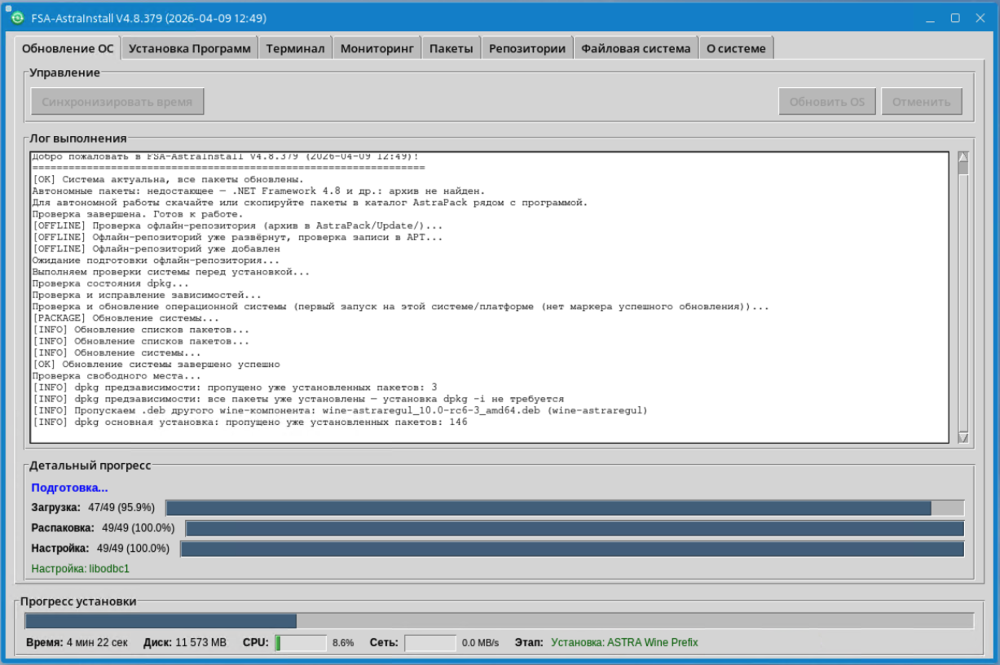
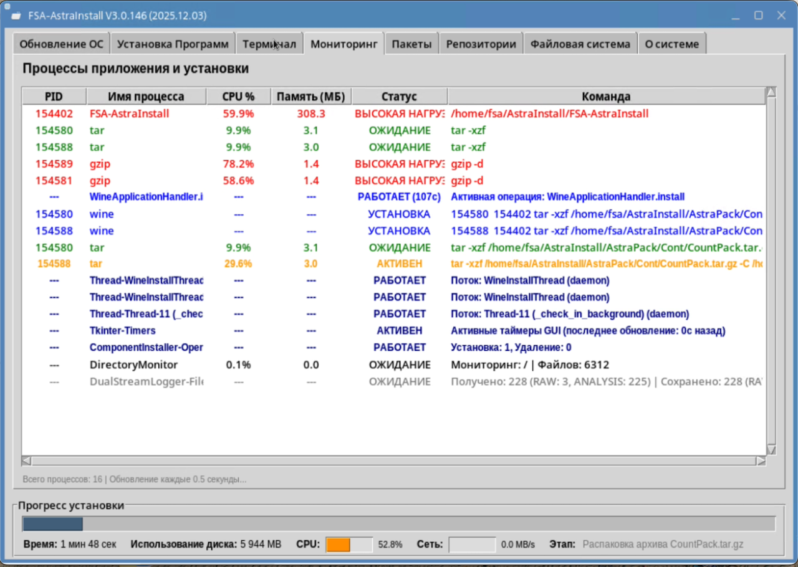
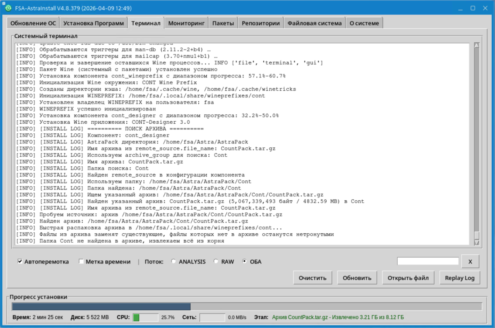

# FSA-AstraInstall Automation V2.3.79 (2025.10.25)
**Компания: ООО "НПА Вира-Реалтайм"**

## Описание проекта

Автоматизированная система для обновления Linux систем (различных дистрибутивов) с установкой Wine и прочих компонентов в автоматическом режиме с возможностью проведения переустановки/удаления в процессе эксплуатации системы.

### Основная задача

**Автоматическое обновление Linux систем** (различных дистрибутивов) из доступных репозиториев с автоподтверждением запросов установщика пакетов и последующей автоматической установкой Wine и прочих компонентов с возможностью переустановки/удаления в процессе эксплуатации.

### Алгоритм работы

1. **Обновление Python** - сначала обновляется Python для работы графического интерфейса
2. **Запуск GUI** - после обновления Python запускается графическая форма
3. **Автоматическое обновление системы** - обновление из доступных репозиториев
4. **Автоподтверждение запросов** - автоматические ответы на запросы установщика пакетов
5. **Установка компонентов** - автоматическая установка Wine и прочих компонентов
6. **Управление компонентами** - возможность переустановки/удаления в процессе эксплуатации

### Основные возможности

#### 🏗️ Архитектура системы
- **UniversalProcessRunner** - класс для перенаправления всех коммуникационных действий в проекте
- **SystemUpdater** - класс для обновления Linux пакетов
- **WineInstaller** - класс для установки Wine компонентов
- **UniversalInstaller** - универсальный установщик компонентов
- **ComponentStatusManager** - менеджер статусов компонентов
- **Единый лог-файл** - все операции записываются в один файл

#### 🎮 Улучшенный GUI
- **Прогресс-бар** - отображение прогресса загрузки пакетов в реальном времени
- **Кнопка "Остановить"** - корректное прерывание процессов
- **Парсинг этапов** - отображение текущего этапа установки
- **Улучшенный терминал** - цветовая индикация и структурированный вывод

#### 🔧 Технические улучшения
- **Исправлен запуск GUI** - корректный запуск с первого раза
- **Устранены дубликаты логов** - единый лог-файл для всех операций
- **Исправлено форматирование** - устранены пустые строки в выводе
- **Улучшена обработка ошибок** - более надежная работа системы

- **Автоматическое обновление Python** - для работы графического интерфейса
- **Графический интерфейс** - удобная форма для управления процессом
- **Автоматическое обновление системы** - из доступных репозиториев Linux систем
- **Усиленное автоподтверждение запросов** - многоуровневая система автоответов:
  - Переменные окружения (DEBIAN_FRONTEND, DEBIAN_PRIORITY, APT_LISTCHANGES_FRONTEND)
  - Опции dpkg (--force-confdef, --force-confold, --force-confmiss)
  - Интерактивное распознавание запросов (русский и английский языки)
  - Увеличенный буфер для многострочных запросов (openssl и др.)
- **Установка Wine** - автоматическая установка Wine для совместимости
- **Установка Astra.IDE** - автоматическая установка среды разработки
- **Удаление компонентов** - безопасное удаление Wine, WINEPREFIX, Astra.IDE и связанных файлов
- **Выбор компонентов** - чекбоксы в таблице для гибкого выбора устанавливаемых/удаляемых компонентов
- **Управление репозиториями** - проверка, обновление, активация/деактивация репозиториев через GUI
- **Системный монитор** - быстрый запуск системного монитора для отслеживания процесса установки
- **Мониторинг процесса** - отслеживание прогресса установки в реальном времени:
  - Прогресс-бар с процентами
  - Время выполнения (мин/сек)
  - Размер установленных файлов (MB)
  - CPU: ████████░░ 80% (постоянный мониторинг по всем ядрам)
  - NET: ███░░░░░░░ 2.5 MB/s (скорость сети в реальном времени)
  - Активные процессы Wine
  - Текущий этап установки
  - Все показатели в одной строке для компактности

### Скриншоты интерфейса

#### Вкладка "Управление" - главный экран


Главный экран для запуска автоматизации обновления системы:
- Режим тестирования (dry-run)
- Кнопки запуска и остановки
- Системный терминал для вывода операций
- Лог выполнения с возможностью сохранения
- Статистика репозиториев и пакетов

#### Вкладка "Wine & Astra.IDE" - управление компонентами


Управление установкой Wine и Astra.IDE:
- Проверка статуса всех компонентов (Wine, WINEPREFIX, winetricks библиотеки)
- Выборочная установка/удаление через чекбоксы
- Мониторинг установки в реальном времени (время, размер, CPU, сеть, процессы Wine)
- Отображение путей к установленным компонентам
- Цветовая индикация статуса ([OK] зеленый, [ERR] красный)

#### Вкладка "Репозитории" - управление источниками пакетов


Управление репозиториями APT:
- Просмотр всех репозиториев системы
- Проверка доступности каждого репозитория
- Активация/деактивация репозиториев
- Обновление списков пакетов (apt update)
- Статистика по активным/отключенным репозиториям

#### Вкладка "Терминал" - системный вывод


Встроенный терминал с выводом всех операций:
- Перенаправление stdout/stderr
- Копирование текста
- Автоматическая прокрутка
- Сохранение логов в папку Log/
- Черный фон для лучшей читаемости

### Технические требования

- Linux x86-64 (Ubuntu, Debian, Astra Linux и другие дистрибутивы)
- Python 3 (базовая версия, обновляется автоматически)
- Права root для установки пакетов
- Доступ к репозиториям системы

### Структура проекта

```
FSA-AstraInstall/
├── README.md                    # Документация проекта
├── astra_install.sh             # 🚀 ГЛАВНЫЙ СКРИПТ - запустите его!
├── astra_automation.py          # Единый файл с GUI и всей автоматизацией
├── test_complete.py             # Тесты синтаксиса и компиляции (для разработчика)
└── original_scripts/            # Оригинальные bash скрипты (для будущей интеграции)
    ├── astra-setup.sh          # Основной скрипт установки
    ├── install-astraregul.sh   # Установка Astra.IDE
    ├── install-wine.sh         # Установка Wine
    ├── install.sh              # Общий скрипт установки
    └── uninstall-astraregul.sh # Удаление Astra.IDE
```

### Режим тестирования (dry-run)

**Что делает dry-run:**
- ✅ **Проверяет** доступность репозиториев
- ✅ **Показывает** какие репозитории будут активированы/деактивированы
- ✅ **Симулирует** обновление системы
- ✅ **Анализирует** статистику пакетов
- ❌ **НЕ изменяет** системные файлы
- ❌ **НЕ устанавливает** пакеты
- ❌ **НЕ обновляет** систему

**Когда использовать:**
- Перед реальной установкой
- Для проверки доступности репозиториев
- Для анализа что будет установлено
- Для тестирования на критических системах

**Пример вывода:**
```
[WARNING] РЕЖИМ ТЕСТИРОВАНИЯ: репозитории НЕ изменяются (только симуляция)
📋 Будет создан backup: /etc/apt/sources.list.backup
📋 Будет проверена доступность всех репозиториев
✅ Будет активирован: http://archive.ubuntu.com/ubuntu
❌ Будет деактивирован: http://old-repo.com/ubuntu
📊 Статистика (симуляция): 3 рабочих, 1 нерабочих
```

### Решение проблемы Python/Tkinter

Для работы графического интерфейса может потребоваться обновление Python:

#### Проблема
- Базовая версия Astra Linux может иметь устаревший Python 3
- Для GUI нужен обновленный Python 3 с Tkinter
- Репозитории Astra Linux недоступны извне (403 Forbidden)

#### Решение
- Скрипты для обновления Python 3 через `apt-get` на Linux машине
- Автоматическая настройка репозиториев Astra Linux
- Установка Python 3 + Tkinter + все зависимости
- После обновления Python запускается графический интерфейс

### Использование

#### 🚀 ОДИН СКРИПТ ДЛЯ ВСЕГО (v2.0.0)
```bash
# Скопируйте проект на Astra Linux машину
# Запустите главный скрипт - он все сделает сам!
bash astra_install.sh
```

**Новые возможности v2.0.0:**
- **UniversalProcessRunner** - централизованное управление процессами
- **SystemUpdater** - отдельный класс для обновления Linux
- **Прогресс-бар** - отображение прогресса в реальном времени
- **Кнопка "Остановить"** - корректное прерывание процессов
- **Единый лог-файл** - все операции в одном файле

**Примечание:** Скрипт автоматически запросит права `sudo` если нужно - не требуется запускать с `sudo` вручную!

Этот скрипт:
- ✅ Автоматически запросит права root через `sudo`
- ✅ Проверит что нужно для GUI
- ✅ Автоматически установит недостающие компоненты
- ✅ Запустит графическую форму для настройки
- ✅ Выполнит автоматическое обновление системы
- ✅ Установит Wine и Astra.IDE

#### Альтернативные способы

**Консольный режим (без GUI):**
```bash
bash astra_install.sh --console
```

**Режим тестирования (dry-run):**
```bash
bash astra_install.sh --dry-run
```

**Консольный режим с тестированием:**
```bash
bash astra_install.sh --console --dry-run
```

**Тестирование синтаксиса:**
```bash
python3 test_complete.py
```

### Процесс автоматизации

1. **Проверка системы** - анализ текущего состояния
2. **Настройка репозиториев** (bash скрипт) - проверка и активация рабочих репозиториев
3. **Обновление Python** - если необходимо для GUI
4. **Запуск GUI** - графический интерфейс для управления (только в GUI режиме)
5. **Обновление системы** (Python скрипт) - из настроенных репозиториев
6. **Автоподтверждение** - автоматические ответы на запросы
7. **Установка Wine** - для совместимости приложений
8. **Установка дополнительных компонентов** - среды разработки и прочие компоненты
9. **Управление компонентами** - возможность переустановки/удаления
10. **Завершение** - отчет о результатах

**Важно:** Настройка репозиториев выполняется один раз в bash скрипте перед запуском Python. Python скрипт использует уже настроенные репозитории для обновления системы.

### Компоненты Python

Для работы GUI устанавливается:
- **python3** - обновленный интерпретатор
- **python3-dev** - заголовки для разработки
- **python3-pip** - менеджер пакетов
- **python3-setuptools** - инструменты сборки
- **python3-distutils** - инструменты дистрибуции
- **python3-tk** - Tkinter для GUI
- **python3-venv** - виртуальные окружения

### Автоподтверждение запросов

Система автоматически отвечает на запросы установщика:
- **dpkg конфигурационные файлы** - согласие на новые версии (Y)
- **Настройка пакетов** - принятие настроек по умолчанию (Enter)
- **Раскладка клавиатуры** - принятие предложенной раскладки (Enter)
- **Переключение клавиатуры** - принятие способа переключения (Enter)
- **Язык системы** - принятие языка системы (Enter)
- **Перезапуск служб** - согласие на перезапуск служб (Y)

### Устранение проблем

#### Репозитории недоступны
```bash
# Проверьте интернет соединение
ping google.com

# Проверьте доступность репозиториев вашей системы
ping archive.ubuntu.com  # для Ubuntu
ping ftp.astralinux.ru   # для Astra Linux
ping mirror.yandex.ru    # для других дистрибутивов

# Если репозитории недоступны, используйте режим тестирования
sudo python3 astra_automation.py --console --dry-run
```

#### Python не обновляется
```bash
# Исправьте зависимости
sudo apt-get install -f

# Обновите вручную
sudo apt-get install python3
```

#### GUI не запускается
```bash
# Установите Tkinter
sudo apt-get install python3-tk

# Проверьте установку
python3 -c "import tkinter"
```

### Техническая информация

- **Целевая система**: Linux x86-64 (Ubuntu, Debian, Astra Linux и другие дистрибутивы)
- **Python версия**: Python 3.x (обновляется автоматически)
- **Архитектура**: amd64
- **Менеджер пакетов**: apt/dpkg
- **GUI библиотека**: tkinter (после обновления)
- **Устанавливаемые компоненты**: Wine, среды разработки и прочие компоненты

### Поддержка

Если у вас возникли проблемы:
1. Запустите тесты: `python3 test_complete.py`
2. Проверьте режим тестирования: `sudo python3 astra_automation.py --console --dry-run`
3. Проверьте логи: `sudo apt-get update`
4. Обратитесь к администратору системы
5. Проверьте документацию Astra Linux

### История проекта

- ✅ Создана автоматизированная система обновления Linux систем
- ✅ Реализован графический интерфейс с tkinter
- ✅ Решена проблема обновления Python 3/Tkinter
- ✅ Создано решение для автоподтверждения запросов
- ✅ Все модули встроены в единый файл astra_automation.py
- ✅ Реализован класс UniversalProcessRunner для перенаправления коммуникаций
- ✅ Проект очищен от лишних файлов и папок
- ✅ Добавлены тесты синтаксиса и компиляции
- ✅ Документация обновлена под новую архитектуру
- ✅ Упрощена логика - убрана поддержка Python 2
- ✅ Реализована установка Wine и прочих компонентов через GUI
- ✅ Добавлена вкладка управления репозиториями
- ✅ Реализован выбор компонентов для установки
- ✅ Добавлена кнопка запуска системного монитора
- ✅ Исправлены ошибки кодировки UTF-8 в winetricks
- ✅ Автоматическое подавление GUI диалогов Wine (rundll32.exe)
- ✅ Реализован комбинированный мониторинг установки (прогресс, время, размер, процессы)
- ✅ Чекбоксы в таблице компонентов для гибкого выбора
- ✅ Возможность удаления установленных компонентов Wine и прочих компонентов
- ✅ Автоматическое управление зависимостями при удалении компонентов
- ✅ Полное удаление с очисткой директорий (/opt/wine-*) и конфигураций
- ✅ Автоматическое закрытие терминала запуска после старта GUI
- ✅ Перенаправление всего вывода на встроенный терминал GUI
- ✅ Синхронизация времени один раз за сеанс (при первом запуске после загрузки)
- ✅ Постоянный мониторинг CPU (по всем ядрам) и сети с прогресс-барами
- ✅ Компактное размещение всех метрик в одной строке (Время, Размер, CPU, NET, Процессы)
- ✅ Автоматическое определение домашней директории реального пользователя (при запуске через sudo)
- ✅ Корректная работа проверки и установки для непривилегированного пользователя
- ✅ Система автоматического обновления с сохранением учетных данных SMB
- ✅ Самообновляющиеся скрипты (копирование в текущую папку)

### Система версионирования

Проект использует двойную систему версионирования:

#### 🏷️ Версия проекта: V2.3.76X
- **MAJOR** (V2.X.X) - кардинальные изменения архитектуры
- **MINOR** (V2.3.76X) - новые функции, улучшения  
- **PATCH** (V2.3.76X) - количество коммитов (сохраненных изменений)

#### 📅 Дата релиза файла: YYYY.MM.DD
- Индивидуальная для каждого файла
- Обновляется только при изменении конкретного файла

#### 📝 Правила обновления:
1. **При изменении функциональности проекта** → обновляем версию проекта во ВСЕХ файлах
2. **При изменении конкретного файла** → обновляем дату релиза ТОЛЬКО в этом файле

#### 🔄 Пример структуры версий:
```
V2.3.76 (2025.10.25) - текущая версия проекта (58 коммитов)
├── astra_automation.py: V2.3.76 (2025.10.25) ← изменен сегодня
├── astra_install.sh: V2.3.76 (2025.10.25) ← изменен вчера
├── astra_update.sh: V2.3.76 (2025.10.25) ← изменен позавчера
└── README.md: V2.3.76 (2025.10.25) ← обновлен сегодня
```

### Планы развития

- 🔄 Автоматическая установка дополнительных Linux приложений
- 🔄 Автоматическая установка Windows приложений через Wine
- 🔄 Создание каталога популярных приложений для быстрой установки
- 🔄 Поддержка разных дистрибутивов Linux (CentOS, Fedora, Arch)
- 🔄 Веб-интерфейс для удаленного управления
- 🔄 Система плагинов для расширения функциональности
- 🔄 Автоматическое создание резервных копий системы
- 🔄 Мониторинг производительности и ресурсов системы
- 🔄 Расширение поддержки различных Linux дистрибутивов